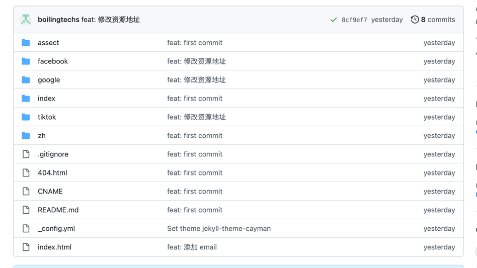
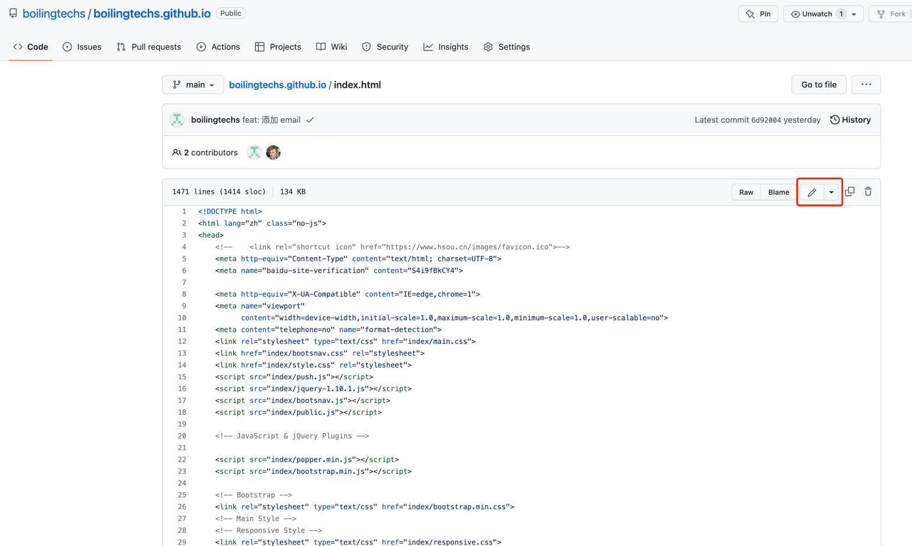
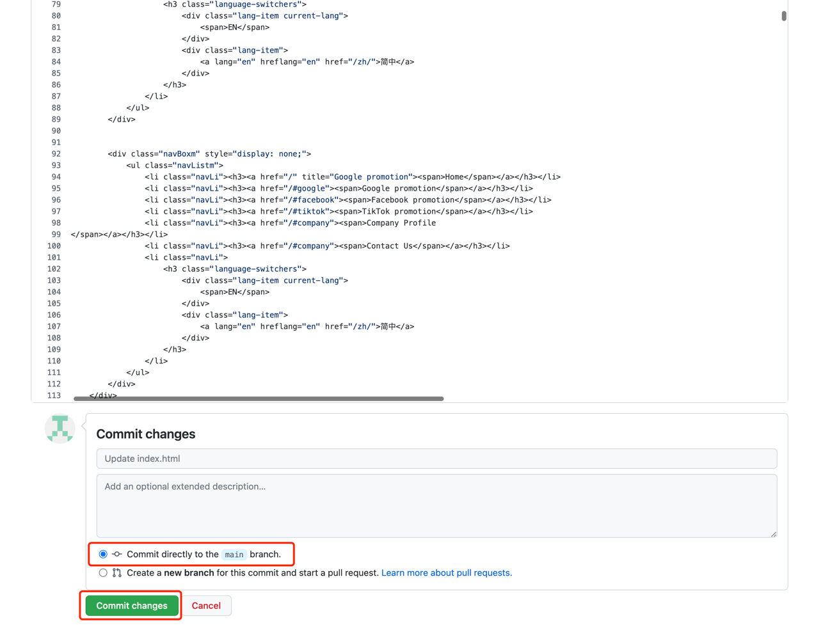

## 目录说明

### 英文：
index.html 英文首页

facebook/index.html 英文 facebook 首页

google/index.html 英文 google 首页

tiktok/index.html 英文 tiktok 首页

### 中文：
zh/index.html  中文首页

zh/facebook/index.html  中文 facebook 首页

zh/google/index.html  中文 google 首页

zh/tiktok/index.html  中文 tiktok 首页

## 如何修改页面内容

上图中圈出的【铅笔】图标，点击后进入编辑页面

修改完毕之后，进入下图的提交修改的操作，点击绿色按钮 【Commit changes】，保存修改内容

